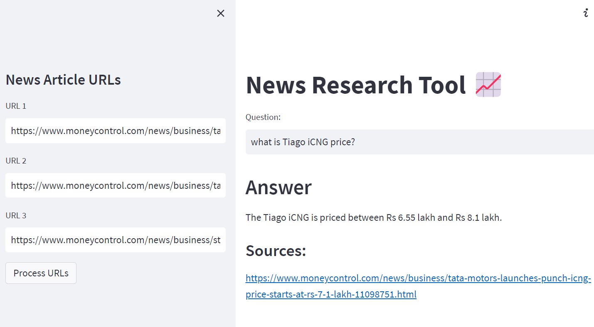

# RockyBot: News Research Tool 📈

A simple RAG (Retrieval-Augmented Generation) app that lets you feed in news article URLs and ask questions about them. Designed for quick research in the stock market and financial domain — paste a few articles, get answers with sources.

Built as a hands-on project while learning RAG and AI frameworks. The original tutorial used paid OpenAI APIs; this version runs on a fully free stack (**Groq** for the LLM, **HuggingFace** for embeddings), making it accessible without any paid API costs.



## Features

- Input up to 3 news article URLs from the sidebar
- Article content is loaded and split into clean chunks via LangChain's `UnstructuredURLLoader`
- Embedding vectors are generated locally using HuggingFace's `sentence-transformers/all-MiniLM-L6-v2` (no API cost)
- Vectors are indexed with **FAISS** (Facebook's similarity search library) for fast retrieval
- Queries are answered by **Groq's Llama 3.3 70B** model — fast, free, and cloud-hosted
- Sources are returned alongside answers so you can verify the information
- Input validation and error handling so the app degrades gracefully on bad URLs


## Tech Stack

| Component | Tool |
|---|---|
| UI | Streamlit |
| LLM | Groq (Llama 3.3 70B) |
| Embeddings | HuggingFace sentence-transformers |
| Vector store | FAISS |
| Framework | LangChain |

## Installation

1. Clone this repository:
   ```
   git clone https://github.com/<your-username>/<your-repo-name>.git
   ```

2. Navigate to the project directory:
   ```
   cd <your-repo-name>
   ```

3. Install the required dependencies:
   ```
   pip install -r requirements.txt
   ```

4. Set up your Groq API key. Create a `.env` file in the project root and add:
   ```
   GROQ_API_KEY=your_groq_api_key_here
   ```
   You can get a free Groq API key from [console.groq.com](https://console.groq.com).

## Usage

1. Run the Streamlit app:
   ```
   python -m streamlit run main.py
   ```
   (On macOS/Linux, plain `streamlit run main.py` also works.)

2. The app will open in your browser at `http://localhost:8501`.

3. On the sidebar, paste up to 3 news article URLs.

4. Click **Process URLs**. The app will:
   - Load the article content
   - Split it into chunks
   - Generate embeddings locally
   - Build a FAISS index and save it to a `faiss_index/` folder

5. Type a question in the main input box. The model retrieves the most relevant chunks, generates an answer, and lists the source URLs it pulled from.

### Example URLs to try

- https://www.moneycontrol.com/news/business/tata-motors-mahindra-gain-certificates-for-production-linked-payouts-11281691.html
- https://www.moneycontrol.com/news/business/tata-motors-launches-punch-icng-price-starts-at-rs-7-1-lakh-11098751.html
- https://www.moneycontrol.com/news/business/stocks/buy-tata-motors-target-of-rs-743-kr-choksey-11080811.html

## Project Structure

* **main.py**: The main Streamlit application script.
* **requirements.txt**: A list of required Python packages for the project.
* **faiss_index/**: A folder containing the FAISS vector store (auto-generated when you click "Process URLs").
   * **index.faiss**: The vector data.
   * **index.pkl**: The chunk metadata mapping vectors back to their source text.
* **.env**: Configuration file for storing your Groq API key (not committed to git).
* **.env.example**: A template showing which environment variables are required.
* **.gitignore**: Tells git which files to ignore (e.g., `.env`, `venv/`, `faiss_index/`).

## Notes

- The first run downloads the HuggingFace embedding model (~90 MB). Subsequent runs are faster.
- The FAISS index persists between runs — you only need to click "Process URLs" once per set of articles.
- If you change the URLs, click "Process URLs" again to rebuild the index.

## Author

Built by **Ebrahim** as part of an ongoing self-directed learning journey in AI/ML and RAG systems.